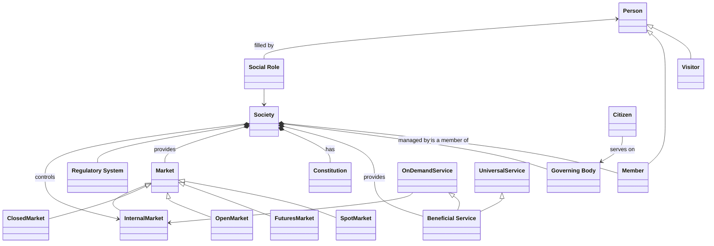
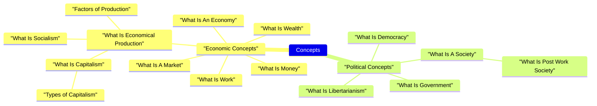

##  Definition Of Terms 

|                                                                                              |                  |
|----------------------------------------------------------------------------------------------|------------------|
| "_It's possible to be both clear and precise, just not at the same time_"                    | Niels Bohr       |
| "_Everything is vague to a degree you do not realize till you have tried to make it precise._" | Bertrand Russell |

The points of the quotes being that...
- Everyday words and ideas seem clear to us only because we use them loosely.
- The moment you try to define a concept or a word with absolute scientific precision, you realize how fuzzy and "vague" the boundaries of human thought actually are.

Bth of these points are worth bearing in mind when reading this "Definition of Terms" section.

Throughout this work there are a number of fundamental concepts, such as "_Society_"; "_Economy_", "_Technology_" that are repeatedly used but whose meanings may not be clear.

Unfortunately, what a word means is generally dependent on the context in which the word is being used. 
So, calling these "Definitions of Terms" is really a bit of a misnomer because they are really explanations about what I personally think a word means and how I'm using it.

In most cases this is because the term is an "_umbrella term_" with no single universally agreed definition that is generally used to group specific variations together into a common classification.
For example, "_Democracy_" is a means of electing people to manage a Society but there are many, many different ways that Democracy has been implemented in different kinds of Society. 

Concepts also tend to evolve over time so that what the term meant when it was originally coined (in some cases centuries ago) is not necessarily what it means nowadays. "_Money_" is an example of this.

Finally, many of these terms are inter-related so the definition may contextually change depending on the definition of some other term.

This leads to complicated set of inter-related concepts, represented in a Concept Map, such as...

These kind of Concept Maps very quickly become unreadable as the number of terms and relationships between those terms increases. 
Consequently, in order to break this down into easier to consume chunks, I'm taking a "**Domain Decomposition**" approach with separate sections for each "**General Term**" (or Domain) and defining significant variations pertinent to this work within each General Term section.

In some cases, I'm also including some history of a term where I think it's important to explain how we get from the original definition to either the agreed present day definition or the specific definition that I'm using.
This leads to a less formal but hopefully more understandable explanation of what a term originally meant and what that same term generally means nowadays. 

I also use a lot of references to Wikipedia pages because Wikipedia is a great start point for anyone that wants to read more detail on a particular topic and contains many cross-references and external links that provide additional information.
In the [Wikipedia Links](/Appendices/WikipediaKnowledgeArticles) page I've included a consolidated list of references that provide a more formal definition of some concept or topic.

