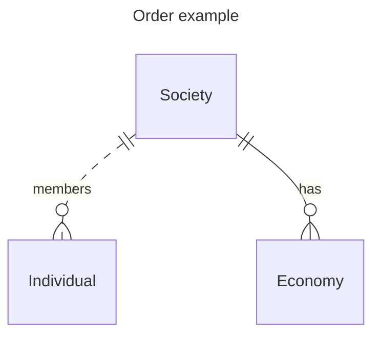

##  Definition Of Terms 

Words have meaning but what that meaning is generally depends on the context in which the word is being used.

Throughout this work there are a number of fundamental concepts, such as "_Society_"; "_Economy_", "_Technology_" that are repeatedly used but whose meanings may not be clear. 

In most cases this is because the term is an "_umbrella term_" with no single universally agreed definition that is generally used to group specific variations together into a common classification.
For example, "_Democracy_" is a means of electing people to manage a Society but there are many, many different ways that democracy has been implemented in different kinds of Society. 

Concepts also tend to evolve over time so that what the term meant when it was originally coined (in some cases centuries ago) is not necessarily what it means nowadays. "_Money_" is an example of this.

Finally, many of these terms are inter-related so the definition may contextually change depending on the definition of some other term.

| Term                              | Short Definition                                                                    |
|-----------------------------------|-------------------------------------------------------------------------------------|
| [Society](WhatISSociety.md)       | A Society is an organized group of individuals grouped together for mutual benefit. |
| [Money](WhatIsMoney.md)           |                                                                                     |
| [Wealth](HowDoWeMeasureWealth.md) |                                                                                     |
| [Market](WhatIsAMarket.md)        |                                                                                     |
| [Capitalism](WhatIsCapitalism.md) |                                                                                     |

