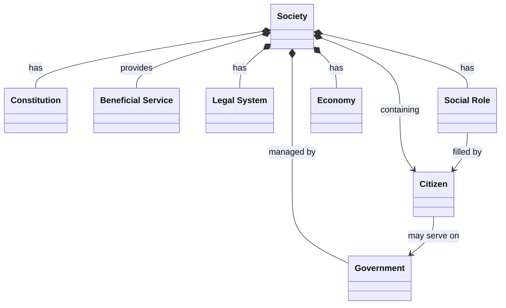

#   What Is Society?

A Society is a group of individual people that have grouped together for mutual benefit; to achieve common goals and to support each other in achieving those goals.

There are many potential kinds of Society but the specific Society I'm considering is a Society with...
- ... a "**Democratic Governing Body**" elected "_by the people, for the people and of the people_"
- ... and a "**Constitution**" outlining the Citizens Rights & Responsibilities
- ... and providing "**Beneficial Services**" to those Citizens

##  Government

Every Society has a Government resposonsible for managing that Society on behalf the its Citizens and with the unique power to make laws and enforce them on everyone.

The governing body of a society is the committee, board of directors, council, or group of trustees legally entrusted with managing the society's affairs. Under legal frameworks like the [Societies Registration Act](https://www.advocatekhoj.com/library/bareacts/societiesregistration/16.php?Title=Societies%20Registration%20Act,%201860&STitle=Governing%20body%20defined) and the [Co-operative and Community Benefit Societies Act](https://www.legislation.gov.uk/id/ukpga/2014/14), this group holds ultimate responsibility for ensuring the organisation operates lawfully, financially securely, and in accordance with its written rules. [1, 2, 3]

The Government (theoretically at least) acts on behalf of the Society's members and its remit is to generally provide...
- Strategic Leadership that outlines the overall path of the Society, approve major policy decisions, and oversee day-to-day operations.
- Financial Oversight and ensure financial risks are managed carefully.
- Legal Compliance to ensures that the Society adheres to its own rulebook (the constitution) and external laws (rules agreed with other Societies)
- Provide commonly agreed Beneficial Services, such as national defence and building public infrastructure.

A common misconception about Government is that it somehow exists separate to Society and is unrepresentative of the needs of its Citizens.

##  Beneficial Service

##  Constitution

A constitution is a fundamental "rule book" that sets up a country's government and protects citizens' rights. 
It outlines the basic principles, structures, and processes of a political system and represents the supreme law of the land. 
Its main jobs include:
- Dividing Power: It establishes the branches of government—usually the Executive (the leaders), the Legislature (the law-makers), and the Judiciary (the courts)—and sets limits on their power so no single branch becomes too powerful.
- Protecting Rights: It defines the fundamental rights and freedoms of citizens, such as freedom of speech or the right to a fair trial.
- Creating a Foundation: It dictates how ordinary laws can be made and how the country itself can be run.

In most countries, like the United States, the constitution is codified i.e. meaning it is written down in one single, sacred document. 
In a few countries, like the United Kingdom, it is uncodified i.e. meaning its rules are spread across multiple historical documents, regular laws, and long-standing traditions.

## Legal System

A legal system is the complete structure that interprets, enforces, and administers the law. It includes:
- The Rules: All ordinary laws, ranging from criminal law (like theft) to civil law (like contract disputes) and traffic violations.
- The People: Judges, lawyers, police officers, and prison staff whose job it is to apply the
- The Institutions: Courthouses, regulatory bodies, and legal procedures 

Within a Society the expectations are that every member of a Society adheres to the Laws of that Society and violations will be prosecuted through the appropriate Legal System.

### Key Differences Between Constitution and Legal System

| Feature    | Constitution                                                                      | Legal System                                                                         |
|------------|-----------------------------------------------------------------------------------|--------------------------------------------------------------------------------------|
| Scope      | Focuses strictly on government power, state structure, and human rights.          | Covers all legal issues, including business, crime, family, and daily behavior.      |
| Purpose    | To govern the government.                                                         | To govern society.                                                                   |
| Hierarchy  | Sit at the absolute top; it is the "supreme law" that all other laws must follow. | Operates beneath the constitution, creating specific rules that must comply with it. |
| Permanence | Intended to be permanent and is usually very difficult to alter or amend.         | Constantly shifting as parliaments pass new laws and courts handle new cases.        |

##  Beneficial Service

##  Economy

An economy is a system of making, buying, selling, and using goods and services to satisfy people's needs and wants - see [Economy](WhatIsAnEconomy.md)

##  Social Role

