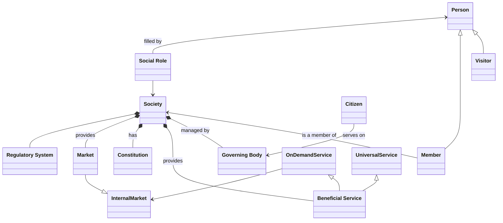

#   What Is Society?

A Society is a group of individual persons that have grouped together for mutual benefit; to achieve common goals and to support each other in achieving those goals.

##  Person

A person is any individual

##  Beneficial Service

##  Regulatory Body

##  Constitution
