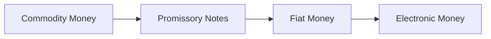
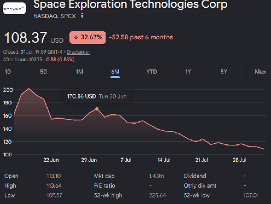

#   What Is Money?

"**Money**" is a funny old thing. 
It is something that we all use every day, but it is also something that is often misunderstood and taken for granted. 

To the vast majority of people **_Money is the means by which things are paid for_** but it has multiple other functions in addition to being just a means of payment. These include...
- Medium of Exchange
- Unit of Account
- Store Of Value
- Standard of Deferred Payment
- A reference point for Prices

"What Is Money?" is also the title of the first chapter of Karl Marx's "Das Kapital" which is well worth reading on its own (reading the other 2,000 pages is really only for the die-hards). 
That's where he defines the forms, purpose and function of Money mentioned above.
Even saying that it's worth bearing in mind that he was writing it around 1850 in the days when all Money, as a Promissory Note, had real value because it was based on ownership of precious commodities such as Gold. 
A Currency Issuer could only issue Money up to the value of the Gold that they had in reserve (the Gold Reserve) and, in theory at least, a Person could take their Money to the National Reserve Bank (Bank of England in the UK) and ask for it to be exchanged into the equivalent amount of Gold.

However, since then Money has changed significantly and evolved through three major stages:
- Commodity Money: Early money that had actual value on its own, such as gold coins, silver, salt, or seashells.
- Promissory Notes
- Fiat Money: The cash we use today (like Pounds, Dollars, or Euros). It has no intrinsic value and is not backed by gold. It has value simply because the government declares it as legal tender and citizens trust it.
- Digital Money: Modern electronic currency, including credit cards, banking apps, and digital wallets, which allow money to move without physical cash ever changing hands.

Today virtually all the Money is Digital Fiat Money that exists solely as an entry in some computerised ledger somewhere with designated Money Issuers (mostly Banks) allowed to create more Money simply by by adding some desired amount to that ledger.
For example...
- That's what happened with "**Quantitative Easing**" during the 2008 Economic Crash when many central bank world-wide decided to increase the available money supply by Trillions (pick your currency of choice) and distribute it into the markets.
- On a smaller scale it's also what Banks do when they extend credit to a borrower such as lend money for a Mortgage. The Money created to fund the Debt is another number in a ledger but doesn't actually exist physically.
- It's also the reason why the value of the Financial Markets can vastly exceed the wealth of a Nation and keep growing even though no more Money is actually in circulation.

This aspect of Fiat Money is critical to understand because it becomes very important later one when we consider subjects like [how society funds itself](../ReformingSociety/EconomicReform/FundingPublicServices) and [Universal Basic Income](../ReformingSociety/EconomicReform/GuaranteedMinimumIncome).

##  The Uses of Money

### Medium of Exchange

The most fundamental function of money is to eliminate the _double-coincidence-of-wants_ problem encountered in a Barter Economy.
Sellers accept money because they can in turn use it to purchase what they need.
By serving as an accepted intermediary in transactions, money dramatically reduces transaction costs and facilitates specialization and large-scale trade.

### Unit of Account

Money provides a common measure in which prices, wages, debts, and accounts are expressed and this common comparability that simplifies economic calculation and the ability to plan, contract, and record value consistently across time and activities.

At least that is the case within a Society but of course isn't so simply across the Societal Boundary with another Society if both of those Societies issue their own Money. 
When that happens we have to take into consideration issues such as...
- Foreign Exchange Rates - how much one kind of Money is worth in another kind of Money
- Purchasing Price Parity - how much can one unit of Money buy in a particular Society
- 

All of these are "technical issues" 

### Store of Value

Money allows value to be held and transferred into the future i.e. Money is a measure of accumulated Wealth.

A reliable store of value preserves purchasing power over time.

### Standard of Deferred Payment

Money serves as the standard in which credit contracts and debts are denominated. 
By standardizing deferred payments, money supports lending, investment, and broader financial intermediation.

##  The Evolution of Traditional Money

Money has evolved over many centuries and take many different forms in that time. These are the types of Money that are still is use today...

### Commodity Money

Historically, many societies used physical commodities with durability and intrinsic value as Money mostly represented as "Coins" made from some metal such as Gold, Silver or Copper. 
Commodities provided durability, divisibility, and broad acceptability and their relative scarcity helped preserve value. 

However, commodity money constrained monetary supply to the physical availability of the commodity and made large-scale credit and complex financial systems difficult because it required the physical transfer of heavy metals to complete a transaction.

The main use of Commodity Money nowadays is in Commodity Trading. 
It's still Ok to pay for something with, for example, Gold Bullion which then gets trundled from one Gold Reserve to another Gold Reserve in some vault somewhere. 
This kind of Money has an Owner not an Issuer.

### Representative Money / Promissory Notes

Representative Money was the second stage in the evolution of Money with the emergence of "**Promissory Notes**" first issued in the 17th Century by London Goldsmiths and formalized when the Bank of England (the worlds first Central Bank) was set up in 1694. 

This moved Physical Money away from being the actual commodity being exchanged to being a claim on the commodity with a promise that the Representative Money could be redeemed or exchanged for a specified quantity of the underlying Commodity (usually Gold).
A Promissory Note simply contained a promise such as "_I promise to pay the bearer the sum of ... in Gold_" printed on them.

This of course led to the so-called Gold Standard that dominated much of the 19th and early 20th centuries and "_Bank Notes_" i.e. Promissory Notes issued by a Central Bank established for that purpose. 
Privately issued Promissory Notes, such as _Letters of Credit_, were and are still being issued (mostly by Merchant Banks) but they do not have the same legal standard as a Bank Note and mostly backed by the reputation of the issuing Merchant Bank.  

This arrangement separated day-to-day transactions from physical commodity transfers (nobody had to carry heavy bags of Gold around any longer) while maintaining confidence through convertibility.

### Fiat Money

This we can think of as the third stage in the evolution of Money and pretty much all modern economies that previously operated using the Gold Standard and Representative Money nowadays operate on Fiat Money.

Fiat Money is Money that is not redeemable by a physical commodity but instead backed by the legal authority of the Issuer (usually a National Government) and, essentially, based on credible monetary policy, and enforceable legal tender laws.

Because there are no underlying Commodities (other than the inherent "_Wealth of Nations_") supporting Fiat Money the confidence in the value of Fiat Money rests on perceived stability and trust in the Issuing Society and enforceable legal tender laws.

As a result the Issuing Society usually designates a Central Bank to controls the supply of Fiat Money (i.e. the Central Bank defines how much Money is in circulation) which uses policy tools to influence inflation, employment, and financial stability.

This is a critical point about Fiat Money - its value is entirely dependent on trust in the Issuing Society. 

####    Electronic Money

Electronic Money, which is *not* the same as Digital Money (see below), is Money that exists only in electronic form and is used for making payments via electronic devices such as computers, smartphones, and payment terminals.

Electronic Money is really a Payment Method (same as a Cheque or Bank Note) rather than another form of Fiat Money but nowadays is so prevalent that it now appears to be some kind of Money in its own right. 
Nowadays Electronic Money includes pretty much all Money Transfers made via Credit & Debit Cards, Automated Payment Systems, On-Line Purchases, Smart-Phones and any other electronic device.
This accounts for something in the region of 90% of all Money Transfers in the developed nations.

##  How Money Is Created

There are three main ways that Money is created in a modern economy and all of them are based on the concept of Fiat Money.
1. The primary mechanism is by the Central Bank of a Nation which creates Money by adding it to the Central Bank's Ledger and then distributing it into the economy via the Banking System.
2. Banks themselves can create Money by extending credit to borrowers and adding it to the Bank's Ledger.
3. A Market Exchange can also create Money via the buying and selling of financial instruments such as Stocks, Bonds, Derivatives and other financial instruments.

### Central Bank Issued Money

A central bank creates money primarily through digital electronic entries, buying financial assets, and issuing physical cash. 
It does this by expanding its own balance sheet by the value of the money it wants to create and then distributing that money into the economy through commercial banks, government spending, or other channels.

Methods of Central Bank Money Creation include...
- Electronic Reserves: The central bank credits digital reserve accounts held by commercial banks, usually when it buys assets like government bonds.
- Asset Purchases (Quantitative Easing): The central bank purchases securities from financial institutions and pays for them by typing new electronic funds into the seller's bank account.
- Physical Currency: It authorizes the production of physical banknotes and coins, exchanging them with commercial banks when they need cash for public withdrawals.

How a Central Bank decides how much Money to issue is generally defined by monetary targets by continuously analyzing economic data like inflation, GDP growth, and employment to adjust the money supply dynamically.

Central banks use specific metrics, economic equations, and frameworks to determine how much money needs to circulate such as...
1. Monitor Key Economic Indicators
   - Inflation Rate: Banks track price indexes against a strict target, usually 2%.
   - GDP Growth: They measure economic output to see if it requires more liquidity.
   - Employment Data: They assess labor market health to balance growth and inflation.
2. Estimate Commercial Bank Demand
   - Reserve Requirements: Central banks calculate the minimum cash commercial banks must hold against their deposits.
   - Public Cash Demand: They use historical trends to predict seasonal spikes in physical cash usage, such as during holidays.
   - Interbank Lending Rates: They monitor how much banks borrow from each other to inject or absorb liquidity as needed.
3. Set Policy Frameworks
   - Macroeconomic Modeling: Economists run complex computer simulations to project how different levels of money creation will impact future prices.
   - Forward Guidance: They align their asset purchases and money issuance with long-term economic forecasts rather than rigid, static calculations.

The key point here is that Money can be (and sometimes is) arbitrarily created by the Central Bank and distributed into the economy without any underlying asset or commodity to back it up.

### Bank Deposit Backed Money

Bank Deposit Backed Money is a kind of Fiat Money and a large share of the modern money supply exists as Bank Deposits i.e. claims on banks that are used for payments via cheques, cards, and electronic transfers.

This is very technical subject (and I'm not going to explain things like the BASEL Accords) but essentially Banks create money through lending such as Loans and Mortgages. 
When a bank extends a loan, it credits the borrower’s deposit account, expanding deposit balances and increasing effective purchasing power.

How much Money a Bank is allowed to create is generally based on the value of the Bank Deposits but, crucially, is usually some multiple of that value known as the Bank Capitalization Ratio.
For example, in the UK a Bank Capitalization Ratio must be at least 14% which means that for every £14 it has in Bank Deposits it can create £100 for Lending i.e. each £1 potentially lend £7.14 hence adding £6.14 to the available Money supply.

However, if the Bank Capitalization Ratio changes then the potential available Money supply also changes e.g. lower the Bank Capitalization to 10% and for each £1 deposited the Bank can now potentially lend £10 adding £9 to the available Money supply.

### Market Exchange Created Money

Financial Markets can also create Money by issuing and trading financial instruments such as Stocks, Bonds, Derivatives and other financial instruments.
They create (and destroy) Money whenever the market value of those financial instruments changes.

For example consider the recent SpaceX IPO where the company raised $1.2 Billion by selling shares in the company to investors. 
The actual Net Asset Value of the company, according to its balance sheet, was around $40 Billion and the company had around 10 Billion shares in issue. So, theoretically each share was only worth $4.00.

However, the initial market value of those shares was set at $135 which was a value set of the market maker based omn what they thought market investors would pay for the shares being issued.

However only around 8% of the shares were actually being sold in the IPO and the rest were being held by the company and its private investors. 
These withheld shares still acquire the same market value as the shares being sold and hence the total market value of the company was set at $1.35 Trillion (10 Billion shares at $135 each). 
The difference between the nominal market values of the shares and the actual Net Asset Value of the company is known as "**Notional Wealth**" or "**Unrealized Wealth**" and is a measure of the potential wealth that could be realized if the shares were sold at their market value.

It effectively became new money that did not exist before the IPO and was created by the Market Exchange and the market valuation of the shares.

In addition, each time the share price changes the total market value of the company also changes. 

##  Non-Traditional Forms of Money

### Digital Money

Digital Money, which is *not* the same as Electronic Money, is Money that only exists in some computerized ledger somewhere and has no legal standing in any given Society.
It currently includes...
- Stablecoins designed to maintain stable value via collateral or algorithmic mechanisms
- Cryptocurrencies like Bitcoin that are decentralized, cryptographically secured units with varying degrees of scarcity and volatility.

These innovations raise questions about privacy, financial inclusion, payment efficiency, regulatory jurisdiction, and monetary sovereignty.

To be honest, I really am against the idea of Digital Currency because they are also in general a "**_Socially Useless Technology_**" though the underlying "Block Chain" technology has uses in very large value money transfers i.e. when transferring Billions between ledgers across the Internet.
For smaller day-to-day financial activity it's difficult to see any value in Digital Money and currently it's pretty much a Speculators Market (and I really dislike those).

The exception to this is the emerging Central Bank Digital Currencies (CBDCs) which are state-issued digital liabilities.

If there is a use for Digital Money then it's in the world of International Trading because the single biggest advantage of Digital Money has over Promissory Money or Fiat Money is that it's Politically Independent i.e. not controlled by any single National Government or the National Politics of any sdingle Nation.
This is potentially very useful.

### Time Credits
 
Pretty much everyone will have at some time or another heard some variant of "_Time is Money_" and in some Economic Systems this is literally the case.

Time, unlike the various currencies issued by Nation States, is a universal currency that is the same for everyone and cannot be created or destroyed.

It's the currency used in Economic Systems like "Skills Exchange" or "Time Banking" where one hour of someone's time (a "Time Credit") is worth exactly one hour of someone else's time no matter what skill set they apply to the work.

This "one hour equals one hour" principle produces a very simple exchange rate mechanism where the value of some work is based on the amount of time they spend doing the work.
