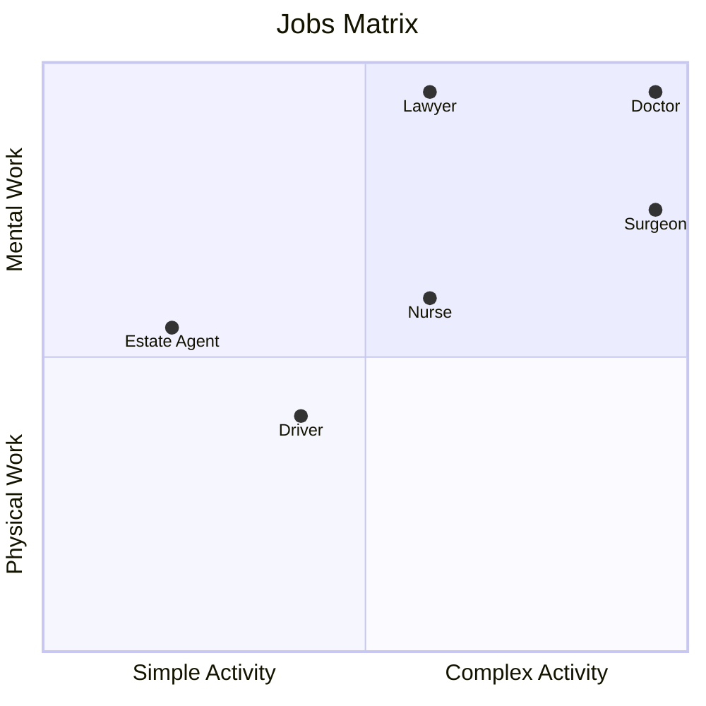

#   What Is Work?

Most people think about "**Work**" in terms of _paid employment_ i.e. they are working when someone is paying them to do something and "_not-working_" when they are not being paid to do anything.
This is a misconception that's deeply ingrained in all the discussions about any kind of Welfare State i.e. the employed are "_in work_" and the unemployed are "_out of work_" implying that if they are "out of work" they are not doing anything. 

The misconception is even ingrained in the title "Post Work Society" because in reality most of the discussion is really about the "Post Paid Employment Society" though I'm going to stick with Post Work Society because that's the general title being used elsewhere.

On the other hand, the general definition of work is "_any activity involving mental or physical effort done in order to achieve a purpose or result_" (Webster's Dictionary). 

This is a much more useful definition and the main reason I prefer this definition is that it then allows us to include all kinds of _unpaid work_ such as...
- Parents engaged full-time in bringing up their children
- Volunteers spending time performing unpaid community services

Expanding the definition to "any kind of work" also means we can introduce other value judgements such as "importance to the running of society" or "makes life better for everyone" that may not be as easily measured but have more relevance when discussing Essential vs. Optional Work.

When it comes to creating a Post Work Society these alternative value judgements become more important because it helps us identify the kind of Work that is essential and, conversely, the kind of work that is of lesser importance.

##  Types of Work

There are many, many different ways that we could classify work activities and many of them are distinct orthogonal classifications.

As per the general definition one way is to define Work by how much physical and/or mental labour goes into completing some piece of work.
Some activities would clearly require a greater degree of physical labour in order to complete that activity whilst other activities are less physical but require a greater degree of thought in order to complete the activity successfully. 

Another way is to define an activity according to its complexity i.e. how much technical knowledge is required to complete the activity or, in some casdes, technical knowledge required just to understand twhat the activity actually is.

Using these two classifications then allows us to build a matrix to classify specific types of work (the job), e.g. Medical Doctor or Electrician, according it's complexity e.g.

##  The Importance of Work

A third classification that we will be using later is the "Importance" of a specific job or activity in relation to the Post Work Society. This is one of the following... 
- Essential Work is the work that needs to be covered somehow for a Post Work Society to function.
- Desirable Work is work that is not essential to complete but is desirable because it  provides a general benefit to Society
- Optional work is any Work that someone chooses to do for their own personal reasons
- Unnecessary Work is work that provides no material benefit to Society in general, that nobody wants to do and nobody would miss if they weren't done.

This becomes important when we get to the details of Essential Services and tha activities necessary to deliver those activities.

Clearly if we want to successfully build a Post Work Society then we need to ensure that Essential Work is delivered and Unnecessary Work is abandoned. 
Desirable and Optional Work should then be encouraged to one degree or another. 

###  Essential Work

The main reason for identifying "**Essential Work**" is that this is the work that needs to be covered somehow for a Post Work Society to function.
If the Essential Work is not done then Society eventually stops functioning.

So what kind of Work would we classify as Essential Work? Fortunately, we have some recent history to look at here taht is helpful for providing examples.

During the COVID Pandemic between 2020 and 2023 when only "Essential Workers" were allowed to leave home it was necessary to do exactly that.
Governments worldwide were forced to classify specific job classes as Essential Workers (or Key Workers) and grouped the workforce broadly into these major sectors... 
- Health and Social Care wprkers required to keep healthcare and emergency infrastructure running.
  * Frontline staff: Doctors, nurses, midwives, paramedics, and dentists.
  * Care workers: Social workers, care home staff, and community volunteers.
  * Support roles: Medical supply chain logistics, pharmacists, lab technicians, and hospital cleaners.
- Public Safety and National Security Personnel responsible for maintaining order, civil protection, and national defense.
  * First responders: Police officers, firefighters, and Emergency Medical Technicians.
  * Justice system: Prison officers, court staff, and probation workers.
  * Defense: Armed forces personnel and Ministry of Defence civilians.
- Food and Necessary Goods Workers ensuring that the public had uninterrupted access to food and essential supplies.
  * Production: Farmers, agricultural workers, and food processing plant staff.
  * Logistics: Warehouse workers, stockers, and grocery delivery drivers.
  * Retail: Supermarket cashiers, convenience store staff, and pharmacists.
- Transport and Logistics keeping supply chains moving and transport networks operational.
  * Freight: Truck drivers, air freight crews, cargo handlers, and maritime workers.
  * Passenger transit: Bus drivers, train drivers, and subway workers necessary for transporting other essential workers.
- Infrastructure, Utilities, and Communications Workers ensuring that homes, hospitals, and remote networks had basic utilities.
  * Utilities: Employees managing the oil, gas, electricity, water, and sewerage sectors.
  * Digital infrastructure: IT professionals, telecommunication field engineers, and data centre operators.
  * Public services: Postal workers, delivery couriers, and waste management/sanitation staff.
- Education and Childcare Staff kept schools and nurseries open specifically to care for the children of other essential workers.
  * Nursery staff, childminders, teachers, and school support workers.
- Government and Critical Financial Services Administrative roles vital to the economic response and public safety.
  * Finance: Essential bank branch workers, payment providers, and cash flow operators.
  * Civil service: Local and national government administrative staff executing the pandemic response.

These individuals were required to work in person because their roles were critical to maintaining societal infrastructure.

So, although this is not a definitive list of all Essential Workers it hopefully illustrates the types of work that may be regarded and important and hence essential.

An important point of this classification (which is not widely discussed) is that in most cases the "**value of the worker**" was not related to how much they earned but based purely on what service was being delivered.
An awful lot of jobs in the above groups would likely be classed as Semi-Skilled Work or Tradesmen (i.e. Simple Manual activities) and very few would be regarded as "Professionally Qualified Workers" - Doctors are the most obvious exception.
This aspect of "value to society" is something to be explored later. 

### Desirable Work

Desirable Work is work that is not essential to complete but is desirable because it  provides a general benefit to Society

If we look at the above list of COVID Essential Work we'll see a number of entries that on their own were not classified as Essential but were included because they supported other Essential Workers.
For example, in that list we have Childcare Staff that kept nurseries open specifically to care for the children of other essential workers. 

In this case Childcare is not an Essential Job because parents can (and do) look after their own children. 
However, for the reason stated, it is desirable so have some kind of Childcare capability in order to provide flexibility   

###  Optional Work

Optional work is any Work that someone chooses to do for their own personal reasons e.g. because they have an interest in the activity or want to learn a new skill or simply wamt to produce something from their own efforts.
The potential reasons are endless and the motivations very specific to each individual but the upshot is that this is work that an individual decides for themselves whether they want ti do it and equally decides for themselves when they wan tto stop doing the work.

###  Unnecessary Work

Unnecessary Work is work that provides no material benefit to Society in general. 

I hesitate to call these "_Bullshit Jobs_" (as per David Graeber's book of that name) burt that's essentially what we're talking about.
These are jobs that nobody really wants to do and nobody would miss if they suddenly stopped being jobs for people. 

As we will see later, an awful lot of work falls into this category.

