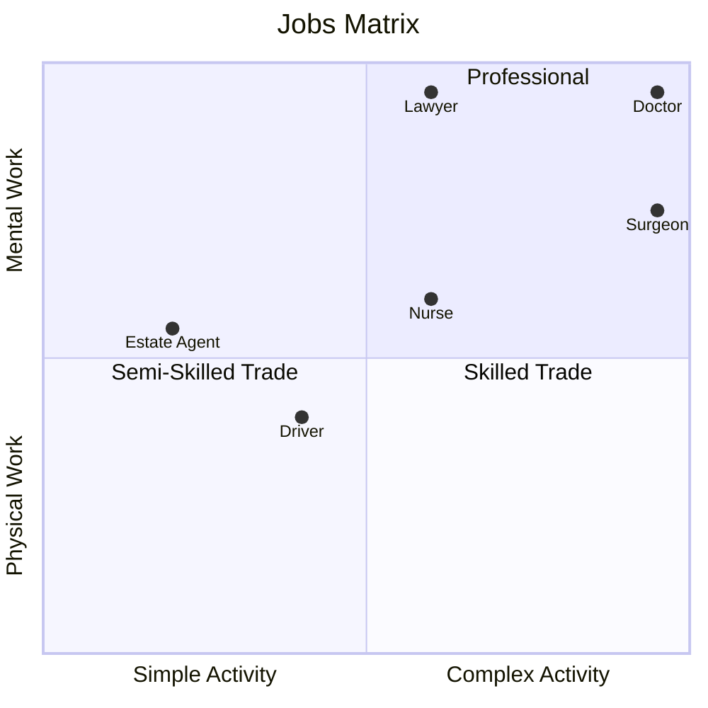

#   What Is Work?

Most people think about "**Work**" in terms of _paid employment_ i.e. they are working when someone is paying them to do something and "_not-working_" when they are not being paid to do anything.
This is a misconception that's deeply ingrained in all the discussions about any kind of Welfare State i.e. the employed are "_in work_" and the unemployed are "_out of work_" implying that if they are "out of work" they are not doing anything. 

The misconception is even ingrained in the title "Post Work Society" because in reality most of the discussion is really about the "Post Paid Employment Society" though I'm going to stick with Post Work Society because that's the general title being used elsewhere.

On the other hand, the general definition of work is "_any activity involving mental or physical effort done in order to achieve a purpose or result_" (Webster's Dictionary). 

This is a much more useful definition and the main reason I prefer this definition is that it then allows us to include all kinds of _unpaid work_ such as...
- Parents engaged full-time in bringing up their children
- Volunteers spending time performing unpaid community services

Expanding the definition to "any kind of work" also means we can introduce other value judgements such as "importance to the running of society" or "makes life better for everyone" that may not be as easily measured but have more relevance when discussing Essential vs. Optional Work.

When it comes to creating a Post Work Society these alternative value judgements become more important because it helps us identify the kind of Work that is essential and, conversely, the kind of work that is of lesser importance.

##  Types of Work

- Essential Work
- Optional work
- Unnecessary Work

These are distinct orthogonal classifications

##  Essential Work

The main reason for identifying "**Essential Work**" is that this is the work that needs to be covered somehow for a Post Work Society to function.
If the Essential Work is now done then Society eventually stops functioning.

So what kind of Work would we classify as Essential Work? Fortunately, we have some recent history to look at here.

During the COVID Pandemic between 2020 and 2023 when only "Essential Workers" were allowed to leave home it was necessary to do exactly that.
Governments worldwide were forced to classify specific job classes as Essential Workers (or Key Workers) and grouped the workforce broadly into these major sectors... 
- Health and Social Care wprkers required to keep healthcare and emergency infrastructure running.
  * Frontline staff: Doctors, nurses, midwives, paramedics, and dentists.
  * Care workers: Social workers, care home staff, and community volunteers.
  * Support roles: Medical supply chain logistics, pharmacists, lab technicians, and hospital cleaners.
- Public Safety and National Security Personnel responsible for maintaining order, civil protection, and national defense.
  * First responders: Police officers, firefighters, and Emergency Medical Technicians.
  * Justice system: Prison officers, court staff, and probation workers.
  * Defense: Armed forces personnel and Ministry of Defence civilians.
- Food and Necessary Goods Workers ensuring that the public had uninterrupted access to food and essential supplies.
  * Production: Farmers, agricultural workers, and food processing plant staff.
  * Logistics: Warehouse workers, stockers, and grocery delivery drivers.
  * Retail: Supermarket cashiers, convenience store staff, and pharmacists.
- Transport and Logistics keeping supply chains moving and transport networks operational.
  * Freight: Truck drivers, air freight crews, cargo handlers, and maritime workers.
  * Passenger transit: Bus drivers, train drivers, and subway workers necessary for transporting other essential workers.
- Infrastructure, Utilities, and Communications Workers ensuring that homes, hospitals, and remote networks had basic utilities.
  * Utilities: Employees managing the oil, gas, electricity, water, and sewerage sectors.
  * Digital infrastructure: IT professionals, telecommunication field engineers, and data centre operators.
  * Public services: Postal workers, delivery couriers, and waste management/sanitation staff.
- Education and Childcare Staff kept schools and nurseries open specifically to care for the children of other essential workers.
  * Nursery staff, childminders, teachers, and school support workers.
- Government and Critical Financial Services Administrative roles vital to the economic response and public safety.
  * Finance: Essential bank branch workers, payment providers, and cash flow operators.
  * Civil service: Local and national government administrative staff executing the pandemic response.

These individuals were required to work in person because their roles were critical to maintaining societal infrastructure.

So, although this is not a definitive list of all Essential Workers

An important side-effect of this classification (which is not widely discussed) is that in most cases the "**value of the worker**" was not related to how much they earned but based purely on what service was being delivered.
An awful lot of jobs in the above groups would likely be classed as Semi-Skilled Work or Tradesmen and very few would be regarded as "Professionally Qualified Workers" - Doctors are the most obvious exception
meaning that they are jobs that could quite easily be shared across most members of society

##  Optional Work

Optional Work is any kind of Work that is not Essential Work 

##  Unnecessary Work

or could be done through some means other than effort by a Human Being.
