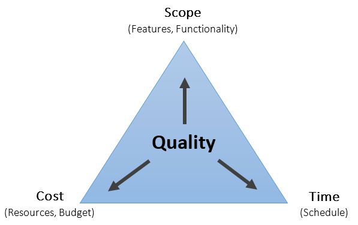
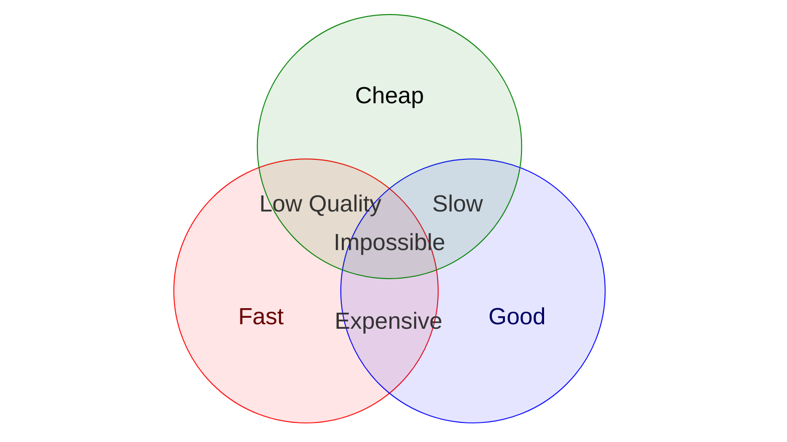

#   Fast, Good, Cheap - Pick Any Two

Formally known as the Project Management Triangle or the "**Iron Triangle**" though I've only ever heard the term "Fast, Good, Cheap — Pick Any Two" used when discussing Software Engineering and Application Development. 
Every other time I've used it people just look at me blankly and ask "What the hell are you talking about?" but I'm including it here because it is a key principle to be aware of when designing and developing any solution.

Essentially it boils down to "_nothing is perfect_" so you have to decide what is most important (time to market, quality of solution or cost paid to develop and maintain it) and then trade-off the consequences of that decision.

##  The Iron Triangle

The credit for formalising this concept goes to a British civil engineer and management consultant named Dr Martin Barnes who first proposed the visual "Iron Triangle" model in 1969 during a course he designed called "Time and Cost in Contract Control" and was originally a triangle but nowadays looks more like this...

Where...
- **Cost** is the amount of resources (generally people) and money available to spend on developing the product
- **Time** is the amount of time available to bring the product to market
- **Scope** defines the features and functionality that are planned to be included in the product

As indicated it's the combination of these (the body of the triangle) defines the overall "_Quality_" of the resulting product.

The key point being that when trying to attain a particular "Quality" level for development of a Product you can only ever optimise for two of these three options and the third will be a direct result of your selection.

##  The Venn Alternative

A common modern-day alternative to the Iron Triangle is a Venn diagram which is a more visual way of representing the same concept including the outcomes of the various combinations of the three options.
It looks like this...

Where...
- **Cheap** reflects the desired overall cost of the product
- **Good** reflects the desired overall quality of the product
- **Fast** reflects the desired overall time to market of the product

For any kind of Application Development there are trade-offs that must be made (usually based on the relative priority of other work) and each trade-off results in a different outcome for the product. as follows...

| Trade Off    | Result      | Outcome                                                                                                                |
|--------------|-------------|------------------------------------------------------------------------------------------------------------------------|
| Fast + Good  | Expensive   | You must pay a premium for rush delivery, expert labor, or top-tier materials                                          |
| Good + Cheap | Slow        | You will wait a very long time because the provider will only work on it when they don't have better paying work to do |
| Fast + Cheap | Low Quality | The final product will be rushed, full of mistakes, or made with poor materials                                        |

