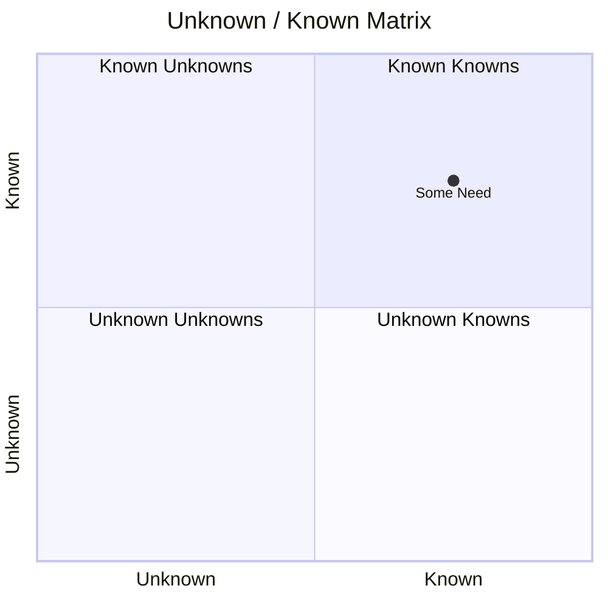

#   Iterate Don't Procrastinate

In the world of Business Analysis there is the concept of "Analysis Paralysis" which is a state of overthinking a situation so much that you cannot make a decision or take action. 
This can be caused by having too many choices, information overload, and perfectionism.

The people suffering from Analysis Paralysis might give lots of reasons for not making a decision, but this is really just Procrastination which is the enemy of progress and can lead to a situation where nothing gets done because people are trying to get everything right before they start. 
It's the thing that killed "Big Up-Front Design" and "Waterfall Development" because it caused projects to stall and fail whilst analysts and designers spent time analysing rather than building.

There are many reasons why it Happens, such as... 
- Too many choices: Having too many options makes it hard to compare them.
- Information overload: Reading too much data or facts causes mental exhaustion.
- Fear of mistakes: Worrying about making the wrong choice creates anxiety.
- The search for "Perfectionism" i.e. waiting for a flawless option stops you from picking a good enough one.

In the Agile Development world this is counteracted by the concept of "**Iterate Don't Procrastinate**" which is the idea that you should not wait to make a decision until you have all the information. 
Instead, you make a decision and then iterate on it as you learn more. _Don't try to get everything right the first time_, but instead iterate and improve over time.

The side-effect of this is that you will make mistakes, but that's OK because you can learn from them and improve your solution.
It also means accepting that in some cases a "[Just Good Enough](JustGoodEnough.md)" solution is the most desirable solution.

##  The "Known Unknowns" Matrix

The "Known Unknowns" Matrix was famously popularized by former US Secretary of Defense Donald Rumsfeld during a news briefing in February 2002. 
However, the underlying concepts and phrasing originated much earlier within the Aerospace, Military, and Psychology sectors.

* Psychologists Joseph Luft and Harrington Ingham created the "Johari Window" in 1955 which mapped interpersonal awareness across identical categories of things known and unknown to oneself and others.
* in the 1960's US Defense procurement contractors and military officials began using the exact phrases "known unknowns" and "unknown unknowns" to manage project risks. 
* The terminology then became standard practice during the 1980's and 1990's at NASA for assessing risk in complex space missions. 
* Finally, in 2002, Donald Rumsfeld used the matrix during a Department of Defense press conference regarding the lack of evidence linking Iraq to weapons of mass destruction.

The matrix breaks down certainty into four distinct fields and looks like this...

where...

|                  | Summary                                                                  |
|------------------|--------------------------------------------------------------------------|
| Known Knowns     | Facts you are aware of and thoroughly understand.                        | 
| Known Unknowns   | Gaps in knowledge that you recognize but lack data on.                   |
| Unknown Knowns   | Implicit insights, intuitions, or facts you fail to realize you possess. | 
| Unknown Unknowns | Unforeseen risks or variables completely outside your awareness.         |

From past experience, I think this is an excellent tool for helping people to understand that they don't need to know everything before they make a decision.

For any given need or requirement, there are always things that you know and things that you don't know and placing them in the matrix is a significant aid to deciding where enough is known in order to make progress.
