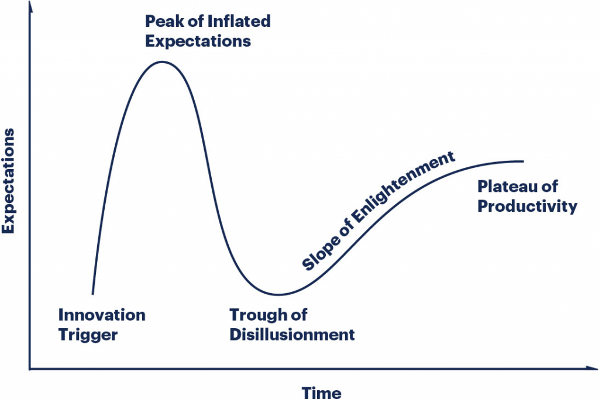

#   Enabling Technologies Summary

**Enabling Technologies** are the various inventions and innovations that potentially help us solve problems and provide capabilities that we need to have in place in order to achieve our Objectives. 
They are the "enabling" factors that allow us to make progress towards our goals.

However, something to bear in mind is that the rate of Technological progress has accelerated (almost exponentially) in the last few decades and new innovations and inventions are announced to the world almost on a daily basis.

Consequently, this is not a definitive list of everything that is currently available but an **_illustrative list of what is possible_** albeit with the distinct possibility that anything in this section could be replaced by something else that does the same thing but in a different, and most likely better, way in the not too distant future.

Another key point is that everything included in this section is either already here (and implemented somewhere in the world) or it's the subject of major research & development projects.

As per the [Principles](/Introduction/Principles.md) laid out earlier, when deciding what to include in this section the major considerations were...
- Is it Sustainable i.e. does it rely on a finite resource that is likely to run out in the near future?
- Is it Scalable i.e. can it be incrementally built or expanded over time?
- Is it Maintainable or does it require a high level of regular physical maintenance? 
- Does it require an overly complex supply chain or manufacturing process?

It's a huge area so doing a deep-dive into each of them isn't really possible and so, in most cases, I've just summarized the technology capability and only provided additional information where the detail is particularly relevant.

I've also tried to group the Technology together where there are multiple technologies that roughly solve the same problem. These are...
- [Sustainable Energy Generation](../ProvidingEssentialServices/EnergyManagement/SustainableEnergyGeneration.md)
- [Internet Communications](../ProvidingEssentialServices/Telecommunications/InternetCommunications.md)
- [Artificial Intelligence](ArtificialIntelligence.md)
- [Automation](AutomationAndRobotics.md)
- [Predictive Analytics](PredictiveAnalytics.md)
- [Interplanetary Mining](InterPlanetaryMining.md)

Of course, we have to be careful about the Gartner "Technology Hype Cycle"...

... because new technology is often over-hyped when it first comes out and then it takes a while for the technology to mature and for people to figure out how to use it effectively.

Fortunately the Technology Hype Cycle isn't a concern for this project because we are planning for the future but focussing on a lot of already well esatblished technology and the hyped-up new technologies should reach the "Plateau of Productivity" by the time we actually need them.

A secondary reason for this section is to highlight "**Human Ingenuity**".
I've always found it fascinating how humans have been able to come up with all kinds of different technologies to solve all kinds of different problems.
Collectively, as a species, we seem to be very good at it and we have a long history of continuous technological improvement.

| [Go to Contents](../README.md) | [Previous (Trends in Society)](../Introduction/IntroductionSummary.md) | [Next (Reforming Society)](../ReformingSociety/ReformingSocietySummary.md) |
|--------------------------------|------------------------------------------------------------------------|-----------------------------------------------------------------------------|
||                                                                        ||