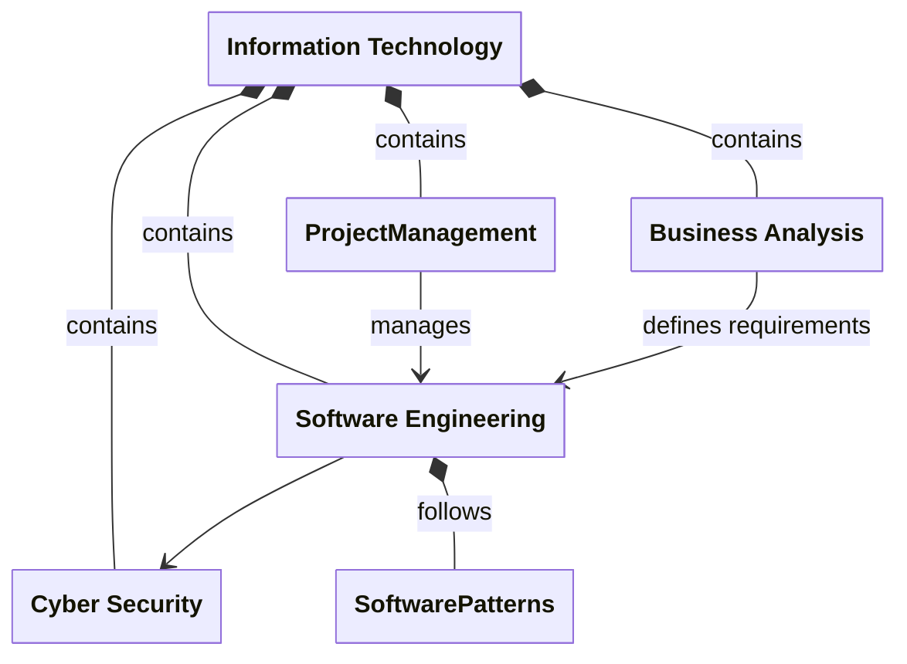
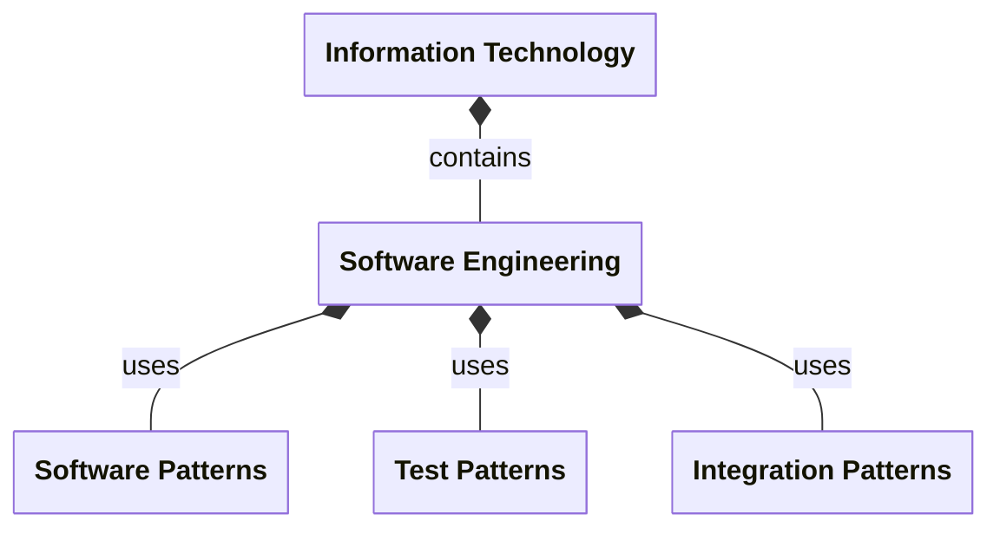

#   Books Of Knowledge

In technical domains like Information Technology (IT) and Medicine, a "**Book of Knowledge**" (BOK) is a formal, curated set of documents that defines the core competencies, standard practices, concepts, and terminology required for a specific profession. 
It serves as the authoritative blueprint for certifications, academic curricula, and professional standards.

Each Book of Knowledge represents everything that is known about some tightly bounded subject area and represents the definitive set of standard methodologies, workflows, and technical terms to ensure consistency across that subject area.

For example in Information Technology (IT) & Engineering the following are existing Books Of Knowledge...
- Project Management Body of Knowledge (PMBOK): Maintained by the Project Management Institute , this is the global standard for managing IT and software projects.
- Software Engineering Body of Knowledge (SWEBOK): Published by the IEEE Computer Society, it outlines the various boundaries and disciplines of software engineering.
- Business Analysis Body of Knowledge (BABOK): Created by the International Institute of Business Analysis , it guides IT business analysts in software requirements gathering.
- Cyber Security Body of Knowledge (CYBOK)): Funded by the UK government, the CyBOK project provides guidelines and standards for cybersecurity concepts and tools.

These Books of Knowledge are maintained separately (by different organizations) but also integrate together to form the more comprehensive Information Technology BOK.

Of course, this domain decomposition can be many levels deep depending on the complexity of the subject area. For example, in the above the Software Engineering BOK could be further sub-divided as follows...

##  Book Of Knowledge and Small Language Models

A Domain Specific Book Of Knowledge closely aligns with the Artificial Intelligence idea of a Small Language Model.
