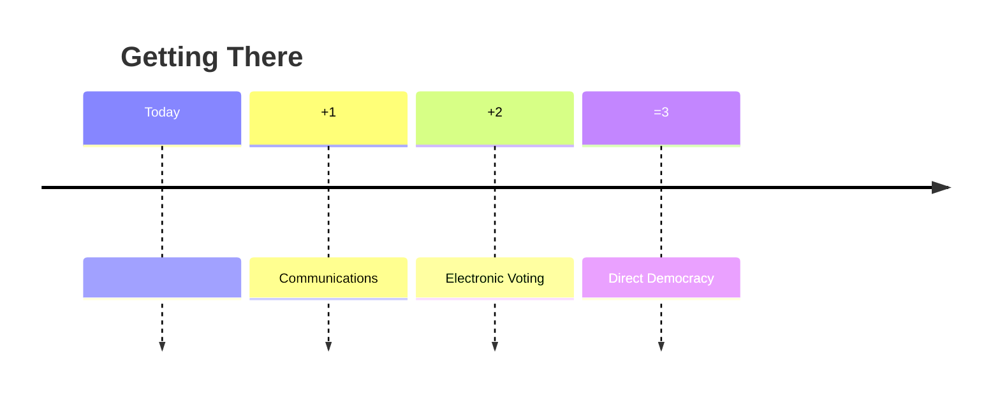

#   Getting There Overview

From experience, when proposing major changes to how things are currently done it's important to also have some sort of plan for how we get from where we are now to where we want to be.

Such plans do not need to be excruciatingly detailed. 
In fact the further out the plan is projected the less detailed it should be because things change over time and new things emerge that can cause plans to change.

Even so, having a plan is not a bad idea for various reasons such as...
- It makes us think about the order that something should be done in to optimise timescales and benefits
- Some things are worth doing irrespective of what the final objectives are
- We can identify and do any essential preparatory work first
- Tasks that are independent of each other can be separated into concurrent work-flows

[Back to Contents](../README.md)