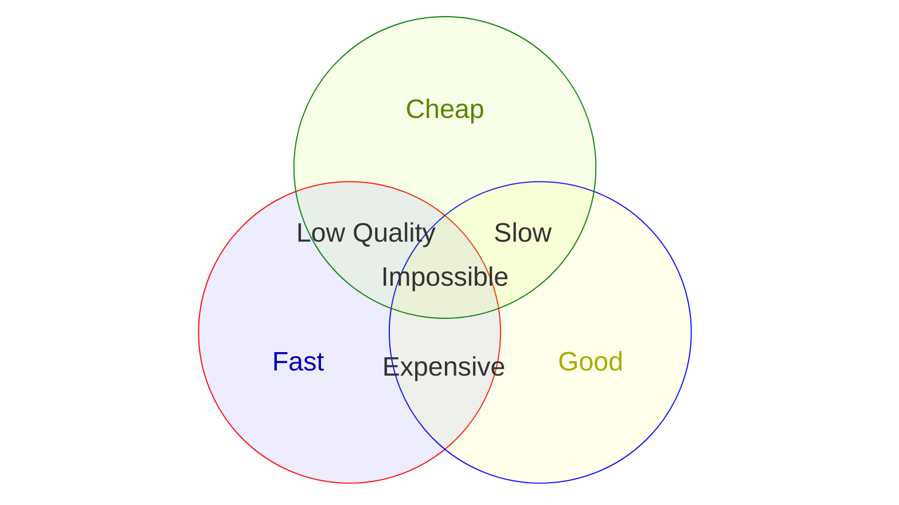

#   Fast, Good, Cheap - Pick Any Two

This classic business rule is formally known as the Project Management Triangle or the "**Iron Triangle**" though I've only ever heard the the blunt phrase "Fast, Good, Cheap — Pick Any Two" used in Software Engineering and Application Development teams.
It is generally used as a funny, direct way to explain the mathematical reality to anyone who wants the impossible.

##  The Iron Triangle

The credit for formalising this concept goes to a British civil engineer and management consultant named Dr Martin Barnes who first proposed the visual "Iron Triangle" model in 1969 during a course he designed called "Time and Cost in Contract Control" and was originally a traiagle but nowadays looks more like this...

Where...
- **Cost** is the amount of resources (generally people) and money available to spend on developing the product
- **Time** is the amount of time available to bring the product to market
- **Scope** defines the features and functionality then is planned to be included in the product

As indicated it's the combination of these (the body of the triangle) defines the overall "_Quality_" of the resulting product.

The key point being that when trying to attain a particular "Quality" level for development of a Product you can only ever optimise for two of these three options and the third will be a direct result of your selection.

##  The Venn Alternative

| Trade Off    | Result      | Outcome                                                                                                                |
|--------------|-------------|------------------------------------------------------------------------------------------------------------------------|
| Fast + Good  | Expensive   | You must pay a premium for rush delivery, expert labor, or top-tier materials                                          |
| Good + Cheap | Slow        | You will wait a very long time because the provider will only work on it when they don't have better paying work to do |
| Fast + Cheap | Low Quality | The final product will be rushed, full of mistakes, or made with poor materials                                        |

