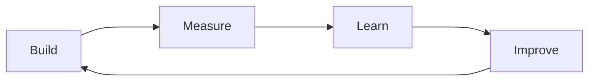

#   Minimum Viable Product (MVP)

A Minimum Viable Product (MVP) is a version of a new product that is built with the absolute minimum set of features required to satisfy early adopters and validate a business concept. [1, 2, 3, 4, 5]
The primary goal of a Minimum Viable Product is to launch quickly, spend as little money as possible, and gather real user feedback to guide future development. [6, 7, 8, 9, 10]

To be a true Minimum Viable Product, a Product must balance three specific characteristics...
- **Minimum**: It contains only the core features that solve the primary problem. No extra bells and whistles.
- **Viable**: It must actually work and provide real, tangible value to the user. It cannot be broken or unusable.
- **Product**: It is a tangible tool, service, or experience that people can interact with and test today.

The Minimum Viable Product is not the final goal but the start of a continuous loop designed to eliminate guesswork

> [Note]
> This process looks very similar to the "**Process of Learning**" in Education. That is not a coincidence.

1. Build: You build the simplest version of your core idea.
2. Measure: You track how real users interact with it (e.g., usage data, retention, sign-ups).
3. Learn: You analyze the data. If users love it, you add features. If they ignore it, you pivot or scrap it.
4. Improve: You iterate on the Product Requirements based on what you learned, and then repeat the cycle.

The key point of the process is that it is iterative and continuous. 
You never stop learning, and you never stop improving.

It also means that we should always be building on top of something that already works and, hence the "Improve" step is always following the "[Evolution Not Revolution](./EvolutionNotRevolution)" principle.

## MVP vs. YAGNI

While closely related, these two concepts tackle product development from different angles:
- Minimum Viable Product is a strategy designed to manage the the scope of a product to ensure you only launch what is necessary to learn from the market.
- YAGNI, on the other hand, is a mindset used during the creation of the MVP to stop developers and analysts from adding speculative, unrequested features.
