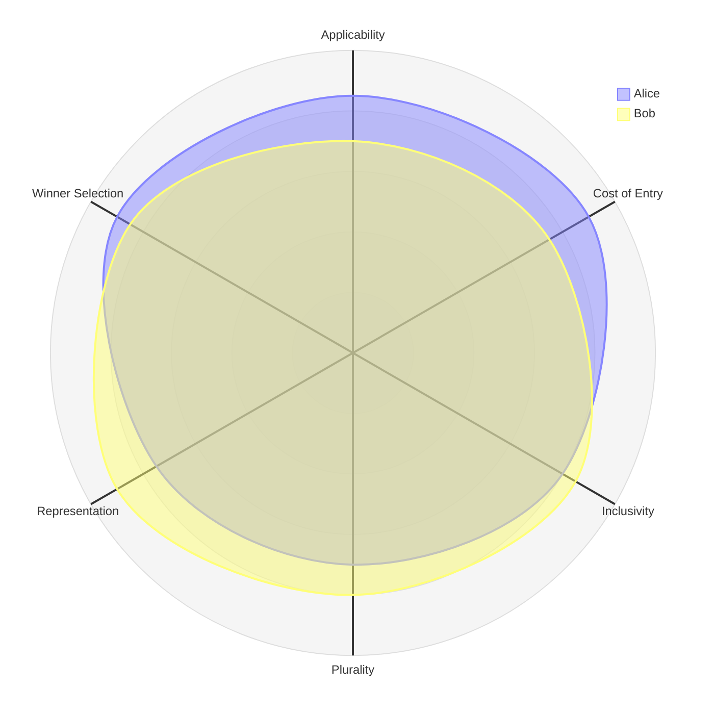
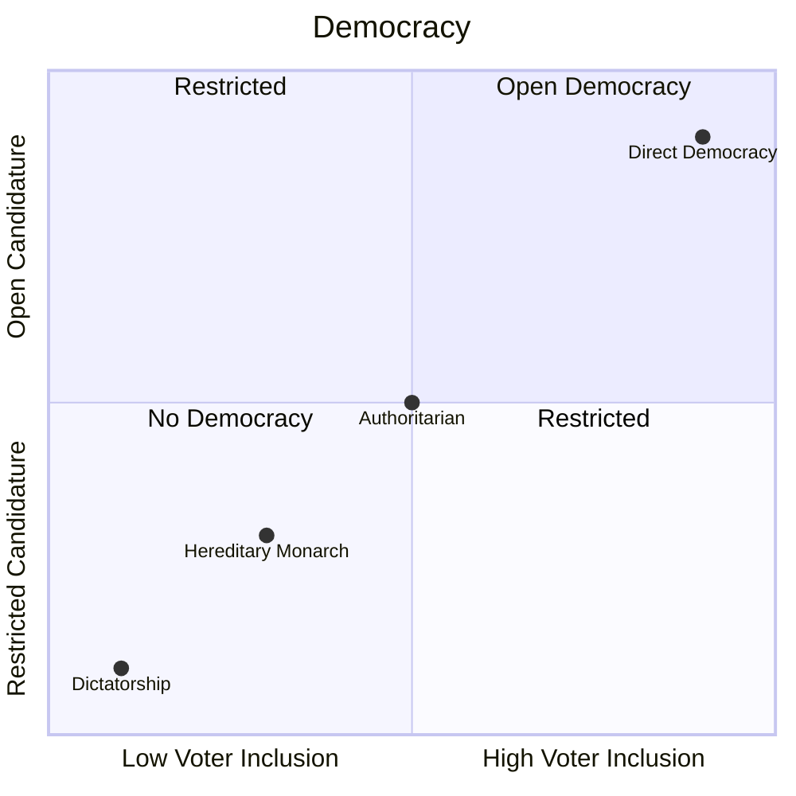

So instead, I'm going to focus on some basic criteria

| Criteria         | Criteria                                                                               |
|------------------------|----------------------------------------------------------------------------------------|
| Voter Inclusivity      |                                                                                        |
| Plurality              |                                                                                        |
| Candidate Eligibility  | Defines which members of a Society are eligible to stand as a candidate in an election |
| Financial Restrictions |                                                                                        |
| Representation         | How representative is the result                                                       |
| Applicability          |                                                                                        |

There are both types (how people are elected) and degrees of Democracy (the scope of who can be elected).

##  Characteristics of Democracy

###  Voter Inclusion

The most common criteria are based on the age of individual potential voters

###  Scope of Candidature

This measures how open a Democracy is to prospective candidates for election.

Traditionally this is measured in terms of the number of Political Parties that are involved in each Election Cycle and how easy it is for any single person to become a Candidate in an Election.

|                       |                                                                                                                                                              |
|-----------------------|--------------------------------------------------------------------------------------------------------------------------------------------------------------|
| Zero-Party Democracy  | All Dictatorships are, by definition, zero-party democracies in that only the Head of State decides who will be responsible for which aspects of Government. |
| One-Party Democracy   | In a One-Party system only members of that party may stand for election. However there may still be multiple candidates in an election.                      |
| Two-Party Democracy   |                                                                                                                                                              |
| Multi-Party Democracy |                                                                                                                                                              |
| Open Democracy        |                                                                                                                                                              |

The ease of becoming a Candidate is significant because there are many countries around the world that may describe themselves as Multi-Party Democracy but are, in reality, a Single-Party or Two-Party Democracy due to other factors.
For example, the USA is a Multi-Party Democracy that is really a Two-Party Democracy (Republicans and Democrats) because the cost of elections, which runs into multiple Billion Dollars during nationwide elections, is a blocker to entry.

##  Types of Democracy

The Types and Degree of Democracy may be orthogonal to each other but they are not divorced from each other.
In practice they form the two axis of a grid

