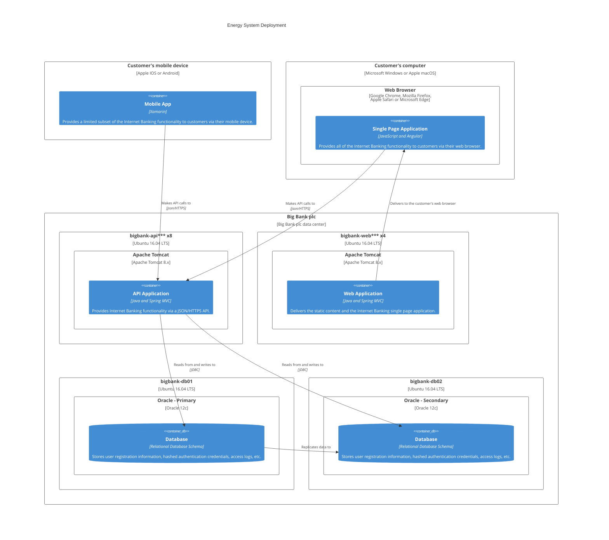

#   Sustainable Energy Management

**Sustainable Energy Management** is (or should be) pretty much the top priority in any modern society (some would say the single most important requirement) and when we talk about Energy Generation we're really talking about "Electricity" because that's what powers pretty much everything that most of us care about.

Fortunately, because of the current focus on "Renewable Energy" and "Sustainable Energy", this is an area that has been exploding wioth new technologies in recent years to the externt that 100% renewable and sustainable electricity generation is pretty much a reality.
Some Countries are already there (e.g. Costa Rica, Iceland, Norway) and many more, including the UK, are on the way andf not far short of being completely self-sustainable.
The cost of renewable energy is now cheaper than fossil fuels in many parts of the world.

>    Note: I'm deliberately not addressing the Climate Change issue in this section.
>    Not saying that it's unimportant (it's actually a critical problem to solve) but it's something that gets resolved as a side-effect of solving the more general Energy Management problem.

So, in this context, Sustainable Energy is essentially the generation of Electricity from resources that do not need continuous replenishment over time.

In addition, when we talk about Resources we are not just talking about the raw energy sources, such as Coal and Oil and Sunshine, but also the materials used to construct whatever mechanism (the technology) is used to convert the raw materials into energy.

In an ideal (and currently non-existent) world this would mean technology that is maintenance free and does not degrade over time but we're not there yet.
Hence, how maintainable a technology is becomes a significant criteria when discussing Sustainable Energy because a solution that needs rebuilding every 5 years is far less sustainable than a solution that lasts for 50 years before it needs replacing. 

This is the difference between Capital Costs and Operating Costs.
The Capital Cost is the cost of initially building the things we need, and once built the Operating Costs are the on-going costs required to keep a solution running once it starts producing

As outlined in [Delivering Energy Generation](./DeliveringEnergyGenerationCapacity) the maintenance of Sustainable Energy generation is decreasing significantly due to the durability of modern materials, such as ceramics, compared to historically significant  materials. 

For the purpose of documenting the enabling technologies for Sustainable Energy Management I've split this into a three part problem...
1. How to generate Electricity from sustainable sources?
2. How to store Electricity until it is required?
3. How to distribute Electricity to where it is needed?

The main reason for separating these three concerns is that [Energy Generation](./EnergyGeneration) is not a single solution and whilst there are many, many deployable technologies for generating energy. 
On the other hand, both [Energy Storage](./EnergyStorage) but [Energy Distribution](./EnergyDistribution) is much more limited.
In addition [Energy Distribution](./EnergyDistribution) is, or should be, a natural monopoly from the viewpoint of the consumer. 

Hopefully, the significance of this split will become very apparent when discussing [Delivering Energy](./DeliveringEnergyGenerationCapacity) and [Funding Energy Management](./FundingEnergyManagement).


```mermaid
C4Dynamic
title Energy Generation Topology

    ContainerDb(c4, "Generation", "", "")
    Container(c1, "Distribution", "", "")
    Container_Boundary(b, "") {
      Component(Solar, "Solar", "", "")
      Component(Wind, "Wind", "", "")
    }
    Rel(c1, c2, "")
    Rel(c2, c3, "")
    Rel(c3, c4, "")

    UpdateRelStyle(c1, c2, $textColor="red", $offsetY="-40")
    UpdateRelStyle(c2, c3, $textColor="red", $offsetX="-40", $offsetY="60")
    UpdateRelStyle(c3, c4, $textColor="red", $offsetY="-40", $offsetX="10")


```

