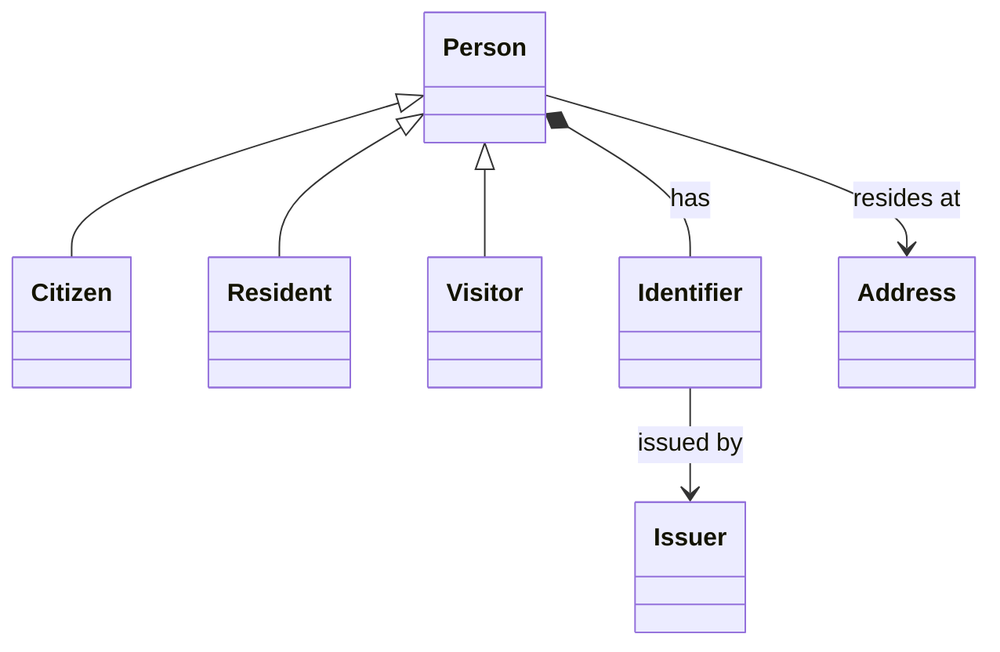

#   National Voter Registry

##  How we identify Registered Voters

Within the UK everyone already has multiple officially issued identification numbers such as...
- "**Electoral Roll NUmber**" issued by a Local Authority for every voter registered in that Local Authority area. **This is already a de-facto Registered Voter Identifier.**
- "**Unique Taxpayer Reference**" issued by HM Inland Revenue to anyone liable to pay tax in the UK
- "**National Insurance Number**" issued by HM Revenue & Customs to anyone over the age of 16
- "**NHS Number**" issued by the National Health Service for every person registered in the NHS
- "**Birth Registration Number**" issued by HM General Register Office 
- "**Unique Pupil Number**" issued to all children in state funded education
- "**Passport Number**" issued by HM Passport Office
- "**Driving Licence Number**" issued by HM Driver & Vehicle Licensing Agency
- "**Voter Authority Certificate**" issued HM Home Office

In addition there are other PASS-accredited identifiers issued by Home Office approved issuers that may be used to prove age and identity of the holder e.g. the Citizen Card.

Everyone has at least one of these identifiers and in most cases will have more than one.

Given the full set of existing Identifiers we in theory do not need to add yet another one to the list. However a few key points here...
1. Most people will not be aware of many of their own official identifiers
2. The systems that issue these identifiers are fragmented and distributed across multiple platforms 
3. 

So, although a National Identity Card is a nice to have it's not a requirement to create one because there are plenty of alternative identifiers that could be used instead. 
We can simply create a database integrating all the existing identifiers in one place and allow any of the existing identifiers to be used  

This then becomes an **Identifier Resolution** problem which would follow the standard "**Key Mapping as a Service**" patterns.

