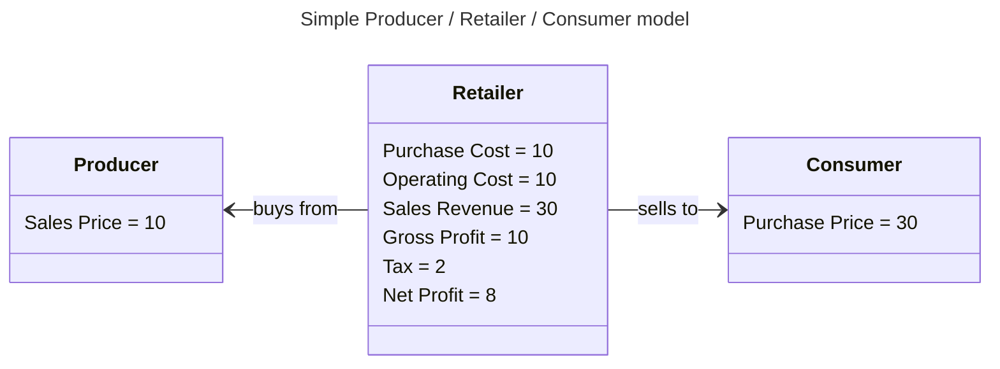
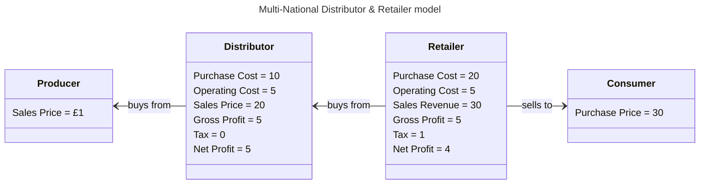

#   Removing Corporate Accounting Loopholes

Taxation Rates across the world are not equal and global Multi-National Corporations regularly use Accounting Loopholes to move Profits from one Taxation Regime into another.
 
This has two main consequences...
1.  It provides an unfair advantage when selling Goods & Services into a Domestic Market because the Seller can lower a Price whilst maintaining their Profit Margin
2.  It reduces the amount of Money raised from Corporate Taxation due to the Corporation artificially lowering their Taxable Profit. 

Pretty much every Multi-National Corporation on the planet does this.

##  How They Do It

How it is done is generally by creating some "artificial cost" that is then charged by one wholly owned subsidiary (registered in the Tax Haven) of the Multi-National onto another wholly owned subsidiary.

As an example, the simplest Producer / Retailer / Consumer model would look something like this where a Retailer is operating in Country that applies a 20% Tax on Gross Profits....

However, let's assume that the Retailer is...
- a Multi-National Corporation that operates across multiple countries and has separate retail outlets in each of those countries
- ... and they buy large quantities of a Product from the Producer such as Coffee Beans 
- ... and that Product is being shipped (distributed) from one Country to another Country
- ... so the Multi-National Corporation sets up a wholly owned subsidiary for the Distribution

This may then give us something that looks like this...

| Line Item      | Distributor | Retailer | Corporation | Note                                                                    |
|----------------|------------:|---------:|------------:|-------------------------------------------------------------------------|
| Purchase Cost  |          10 |       20 |          10 | Inter-company Purchases are excluded from Aggregated Corporation amount |
| Operating Cost |           5 |        5 |          10 | -- ditto --                                                             |
| Sales Revenue  |          20 |       30 |          30 | -- ditto --                                                             |
| Gross Profit   |           5 |        5 |          10 |                                                                         |
| Gross Tax      |           0 |        1 |           1 | Corporation value is sum of the constituent values                      |
| Net Profit     |           5 |        4 |           9 | Corporation value is sum of the constituent values                      |

The Multi-National Corporation has now increased its Net Profit from 8 to 9 not by increasing its Sales or decreasing its Costs but simply by moving the Profit from Retailer subsidiary to the Distribution subsidiary.

The overall Multi-National Corporation can now move as much Profit from the Retailer to the Distributor as they see fit depending on how they adjust the Purchase Price that the Distributor charges the Retailer

This, of course, is the "simple model" and the reality can be much more complex. 
For example,
- Other kinds of "identifiable costs", such as Intellectual Property and Management Fees, can be related using a similar approach by setting up a "Holding Company" and then paying Fees to that Holding Company.
- Many countries provide various Tax Reliefs when a Corporation makes a Trading Loss and, hence, beneficial for the Distributor to increase the cost to the Retailer sufficiently to cause a Trading Loss in order to qualify for Tax Relief.
- A chain of intermediaries can be created to route a cost through multiple Tax Jurisdictions allowing for multiple Tax Reliefs.

##  Proposed Changes 

The United nations has proposed the "Unitary Taxation & Formulaic Apportionment" framework : Civil society groups and developing nations propose treating multinationals as single unitary businesses. 
Instead of using the complex "transfer pricing" system (which allows Multi-National Corporations to artificially price internal transactions to hide money in tax havens), 
the overall Corporate Profit would be allocated to a Country based on real economic factors like employee count, payroll, sales, and physical assets.

In addition "Public Country-by-Country Reporting" (CbCR), is proposed by groups such as the Tax Justice Network, intend to legally mandate that multinationals publicly publish their profits, employee counts, and taxes paid for every single country they operate in. 
This is designed to expose and deter aggressive tax-dodging schemes through public accountability.

Taken together these two proposals would ensure that the Profit of Multi-National Corporations is fairly apportioned and subsequently taxed to be benefit of the Country in which the Profit was generated.  
