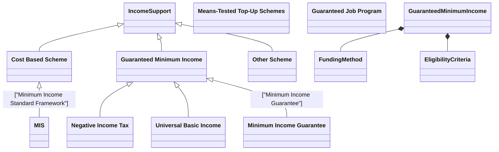

- Means-Tested "Top-Up" Schemes: The most common model, currently found across many European nations and local systems. If a household's total earnings fall below the guarantee threshold, the government pays the difference.
- Negative Income Tax (NIT): Proposed by economist Milton Friedman, this system replaces traditional welfare with a tax-based approach. Families earning above a certain threshold pay taxes, while those below it receive "negative" taxes (subsidies) that gradually decrease as earned income increases, maintaining work incentives.
- Universal Basic Income (UBI): A closely related, unconditional variant. Instead of only topping up the poor, a regular cash payment is given to every individual, regardless of their employment status or other wealth.
- Minimum Income Guarantee (MIG): A broader, modern framework that guarantees an income floor met through fair paid wages, targeted welfare payments for those unable to work, and state-subsidized public services.
- Guaranteed Job Programs (Jobs Guarantee): An alternative system where the government guarantees a job at a living wage to any citizen willing and able to work, ensuring they never fall below the income floor.
- Minimum Income Standard (MIS) Framework

##  Universal Basic Income (UBI)

##  Negative Income Tax

##  Working Credits

